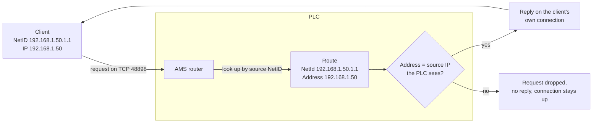

# How it works

Background that makes the settings make sense. None of it is required reading to get data flowing —
[Quick start](quick-start.md) is enough for that.

## How ADS works

Four ideas cover almost everything you need to configure this input.

**A router, not a device.** Every TwinCAT system runs an AMS router, and you always talk to the
router rather than to the PLC program directly. It forwards each request to a device behind it —
the PLC runtime, the I/O layer, the logger — selected by a port number. `851` is the first PLC
runtime on TwinCAT 3, `801` on TwinCAT 2.

**Two addresses, not one.** The IP address gets you to the router; an **AMS NetID** — six numbers,
usually written like an IP with `.1.1` appended — identifies the system at either end. Your request
carries both your own NetID and the target's. The plugin asks the PLC for its NetID on connect, so
normally only the IP needs configuring.

**A route authorises you.** The PLC answers only clients it has a route for: an entry pairing your
NetID with the address it expects you to come from. Routes live on the PLC, survive reboots, and
can be created by the plugin itself (`username` + `password`) or by hand in TwinCAT. If a request
arrives with no matching route, the connection is accepted and then simply ignored — the most
common cause of a bridge that looks connected but reads nothing. See
[How a route is matched](#how-a-route-is-matched).

**One connection, two ways to read.** Everything runs over a single outbound TCP connection to port
48898, and normally no inbound port is needed. On that connection you either poll (`readType: interval`) or
subscribe and let the PLC push values when they change (`readType: notification`, the default and
usually the better choice). Symbols are addressed by name, so `GVL_ProcessData.nMasterCycleCounter`
is all you need; the PLC resolves it to a handle for you.

## Getting the PLC to accept this client

The PLC answers only clients it has a route for, so a route has to exist before any
data flows. There are three ways to arrange that:

1. **TwinCAT Connection Manager**: Use the TwinCAT connection manager locally on the host, scan for the device and add a connection using the correct credentials for the PLC (Connection manager only available on windows).
2. **Static route on PLC**: Log in to the PLC using the TwinCAT System Manager or Visual studio XAE and add a static route from the PLC to the client. When adding the route, specify the IP and the AMS ID of the UMH instance. Best practice: use the VM's IP as the base and append `.1.1` for the AMS ID (e.g., VM IP `192.168.1.45` → AMS ID `192.168.1.45.1.1`).
3. **Automatic route registration (UDP)**: set `username` and `password` and the plugin registers a route on the PLC itself before connecting — see [Route Registration](networking.md#automatic-route-registration). Set `hostIP` as well: it decides the address stored in that route, and it must be the address the PLC sees this client as. Left empty it is auto-detected, which in a container gives an internal IP that the PLC cannot match and that makes route entries hard to recognise later. See [How a route is matched](#how-a-route-is-matched).

## How a route is matched

An AMS route pairs an AMS NetID with an address, and the runtime uses both. The NetID selects the route — it must equal the source NetID the client advertises — and the address is checked against the **source IP the runtime observes**. If they disagree, the TCP connection stays up and the requests are silently dropped: no error, no reply. Replies to requests that do pass come back over the connection the client opened.



`NetId` only has to match what the client advertises (`hostAMS`) and need not resemble the address.
`Address` must equal the source IP the PLC observes — note *observes*, not *can reach*.

Replies and notifications normally arrive over the connection the client opened, so a bridge works
from a Docker container with no inbound path and no listening ports.

A device can instead answer only on a connection it opens back to the client on TCP `48898`. The
plugin detects that and adopts the connection, so it needs no configuration — but the port then has
to be bindable on the client host and reachable inbound from the PLC, or that device cannot be read
at all. A failed bind is logged as a warning naming the port.

Routes are bidirectional by default. The `Unidirectional` checkbox in the route dialog makes the
runtime refuse ADS calls that the client's system originates over that route. Leave it unset, which
is both the default and what Beckhoff recommends for a route used this way.

A wrong `Address` produces a session that connects and registers successfully and then fails,
usually as repeated request timeouts rather than a connection error.

Automatic registration derives both fields from `hostIP` (`Address` = `hostIP`, `NetId` = `hostIP`
+ `.1.1`). Firmwares differ in what they store when `hostIP` is left empty — some record the source
address they observe, others the value the client advertises — so set `hostIP` explicitly, or add
the route manually.

Note that the last two octets of an AMS NetID are a *sub-address*: routes match on the first four, so `192.168.1.50.1.1` and `192.168.1.50.9.9` resolve to the same route.

## Notifications or polling

The `interval` and `notification` read types can produce similar-looking results (periodic data), but they work differently under the hood:

- **`interval`**: The client polls the PLC — sends an ADS Read request for each symbol at every `intervalTime` interval. Simple, no PLC notification overhead, and not subject to the ~500-notification limit.
- **`notification` + `serverOnChange`**: The PLC pushes data only when a value changes. Most efficient for event-driven data. Subject to the ~500-notification limit per connection.
- **`notification` + `serverCycle`**: The PLC pushes data at every `cycleTime` interval regardless of changes. Similar result to `interval` but PLC-driven — more precise timing with no request/response overhead per cycle. Subject to the ~500-notification limit.

| Aspect | `interval` | `notification` + `serverOnChange` | `notification` + `serverCycle` |
|--------|-----------|-----------------------------------|-------------------------------|
| Who drives | Client polls | PLC pushes on change | PLC pushes on timer |
| Network per cycle | Request + response | Push only | Push only |
| Sends unchanged values | Yes | No | Yes |
| Timing precision | Subject to network latency | PLC real-time task | PLC real-time task |
| PLC notification limit | No limit | ~500 max | ~500 max |
| Best for | Large symbol lists, simple setup | Event-driven data (most use cases) | Precise periodic sampling |

## Choosing cycleTime and maxDelay

**cycleTime** controls how often the PLC checks the variable:
- `serverCycle` mode: PLC sends a notification every `cycleTime` regardless of value change
- `serverOnChange` mode: PLC checks the value every `cycleTime` and sends a notification only if it changed

**maxDelay** controls how long the PLC can buffer notifications before sending:
- The PLC collects notification events and sends them in a batch when `maxDelay` expires
- This is a network optimization: fewer packets, multiple notifications bundled in one AMS packet

**Practical example** — `cycleTime: 10ms`, `maxDelay: 100ms`, mode `serverOnChange`:
1. PLC checks variable every 10ms
2. If value changed, queues a notification
3. Sends queued notifications at most every 100ms (batched)

**Edge cases:**
- `maxDelay: 0s` — send immediately, no batching
- `cycleTime: 0s` — check as fast as the PLC task cycle allows
- `maxDelay` < `cycleTime` — effectively no batching (fires before next check)

Think of it as:
- **cycleTime** = polling interval (sensor sampling rate)
- **maxDelay** = delivery batch window (network efficiency)

**Important:** If a variable changes faster than `cycleTime`, intermediate values are missed:

```text
cycleTime = 1000ms, mode = serverOnChange

Time:    0ms    200ms   400ms   600ms   800ms   1000ms
Value:   5  →   10  →   3   →   7   →   2   →   8
PLC checks:  ↑                                    ↑
Notifies: 5                                       8  (missed 10,3,7,2)
```

The PLC only samples at `cycleTime` intervals. Between checks, it is blind — this is not a continuous event stream.

For fast-changing values, set `cycleTime` close to the PLC task cycle time (typically 1–10ms). The trade-off is more CPU load on the PLC and more network traffic. Even at minimum `cycleTime`, there is no guarantee of capturing every value — if a variable changes twice within one PLC scan cycle, the intermediate value is lost. ADS notifications are polling with push delivery, not event capture.

```yaml
input:
  ads:
    transmissionMode: "serverOnChange"     # default, sends only on value change
    # transmissionMode: "serverCycle"      # sends at every cycle regardless of change
    # transmissionMode: "serverOnChange2"  # enhanced, auto-falls back on older PLCs
    # transmissionMode: "serverCycle2"     # enhanced cyclic, auto-falls back on older PLCs
```

## What to expect from notifications

### First batch completeness

When `readType: notification`, TwinCAT sends an initial sample for every subscribed symbol immediately on registration (all modes except `NoTransmission`). The plugin waits for these initial samples before returning from `Connect`, so the **first `ReadBatch` always returns a complete batch** containing one message per successfully registered symbol. No separate read or warm-up period is needed to get the current state of all symbols.

### Partial registration failures

If a symbol fails to register (unknown name, PLC-side ADS error), the plugin:
- Logs an **error** through the Benthos logger identifying the symbol and reason
- Continues with the remaining symbols — data flows for all successfully registered symbols
- Does **not** trigger a reconnect for partial failures; only a full failure (zero symbols registered) forces a reconnect

This means a misconfigured symbol name is surfaced immediately in logs without blocking data from the other symbols.

### Interval read — empty batches during reconnect

When `readType: interval`, the first one or two batches after a reconnect may be **empty or partial** while symbol handles are re-resolved. This is normal — Benthos retries the next poll and subsequent batches are complete. No action is needed; the gap is typically one poll interval (default 1 second).
