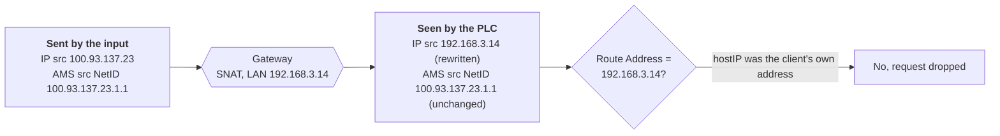

# Networking

What to configure when something sits between this plugin and the PLC (a container
boundary, a router, or a VPN), and how to create a route by hand.

## Where the input runs

The network side, for whoever administers the host and the network path between it and the
PLC.

### Containers and Kubernetes


ADS works from inside Docker containers with default bridge networking. You need no `host_network`
and no port forwarding: requests, responses and notifications normally all flow over the single
outbound TCP connection the plugin opens to port 48898. One case does need inbound `48898`, a device
that answers only on a connection it opens back to the client. See
[How a route is matched](how-it-works.md#how-a-route-is-matched).

The only other requirement is that the `hostAMS` value matches a route registered on the PLC. When running in Docker with bridge networking:
- **`hostIP` should be set** to the Docker host's IP on the PLC network (e.g. `192.168.1.50`). Left empty it auto-detects the container's bridge IP, which the PLC cannot match. See [How a route is matched](how-it-works.md#how-a-route-is-matched).
- **`hostAMS` can be set explicitly** to `hostIP` + `.1.1` (e.g. `192.168.1.50.1.1`), or left as `auto`: when route registration is configured with `hostIP`, `auto` will correctly derive the AMS NetID from `hostIP` instead of the container's bridge IP.
- **A route must exist on the PLC** for the `hostAMS` NetID. This can be added manually in TwinCAT System Manager, or automatically via the `username`/`password` config fields.
- **`hostPort` is optional** (default 0 = random per session). It is a logical AMS port used in protocol headers, not a network port.

**Option A: Automatic route registration (recommended)**

The plugin registers a route on the PLC automatically via UDP before connecting. No manual PLC configuration needed:

```yaml
input:
  ads:
    targetAddress: "192.168.1.100"
    hostAMS: "auto"                        # derives NetID from hostIP
    hostIP: "192.168.1.50"                 # Docker host IP (required in bridge networking)
    username: "Administrator"              # triggers automatic route registration
    password: "1"
    unifiedAddress:
      - "MAIN.MyVariable"
```

You can also set `hostAMS` explicitly if you prefer:

```yaml
    hostAMS: "192.168.1.50.1.1"            # explicit: Docker host IP + .1.1
    hostIP: "192.168.1.50"                 # must match
```

**Option B: Static route on PLC**

If you prefer not to use automatic registration, add a static route on the PLC via TwinCAT System Manager pointing to the Docker host's IP. Then configure `hostAMS` to match. No `username`/`password` needed:

```yaml
input:
  ads:
    targetAddress: "192.168.1.100"
    hostAMS: "192.168.1.50.1.1"            # must match the route on the PLC
    unifiedAddress:
      - "MAIN.MyVariable"
```

**Option C: host_network or macvlan**

When the container has a routable IP on the PLC network, `hostAMS: auto` works without `hostIP`:

```yaml
input:
  ads:
    targetAddress: "192.168.1.100"
    hostAMS: "auto"                        # auto-derive from the container's real IP
    username: "Administrator"              # optional: auto-register route
    password: "1"
    unifiedAddress:
      - "MAIN.MyVariable"
```

### PLC behind a port-forwarding router


When an IT router maps an external port to the PLC's internal ADS port (for example, external `4233` → internal `48898`), set `targetAddress` to the **external** IP and port:

```yaml
input:
  ads:
    targetAddress: "203.0.113.10:4233"   # router's external IP:port, forwarded to PLC port 48898
    targetAMS: "5.3.69.134.1.1"          # set explicitly: discovery uses UDP 48899, which the forward does not carry
    # ...
```

AMS NetID routing is independent of IP and port, so it still resolves correctly once the TCP connection is established.

Automatic route registration uses **fixed UDP port 48899** and cannot follow a port-forwarded path. Behind NAT or a port-forwarding router, register the route **manually on the PLC** (via TwinCAT System Manager → Routes) and leave `username` and `password` empty.

### PLC behind a NATing gateway or subnet router


`hostIP` becomes the address stored in the PLC's route, and the PLC then compares the **source
address it observes** against its stored routes. Any gateway that rewrites the source (a VPN
subnet router doing SNAT, a NATing firewall) makes every client behind it appear as the
gateway's own LAN address. `hostIP` has to be that address, not the client's.



NAT is an IP-layer operation: it rewrites the IP source and leaves the AMS header alone. So the
PLC receives a request whose IP source and AMS source disagree, and it answers on the basis of the
AMS one.

The route the client registers stores its own address, but the runtime sees the gateway's, so the
two disagree and every request is dropped without an answer. That is the whole failure, and it
applies to every runtime: reachability of the stored address is irrelevant, only whether it equals
what the runtime observes.

Removing the translation fixes it outright. Where it has to stay, `hostIP` must be the gateway's
address, so that what the route stores and what the runtime observes agree.

With `hostIP` left as the client's own address the input appears to start normally (the route
registers, the connection is accepted) and then fails. Which way it fails varies from device to
device rather than following the runtime version:

- it serves data for a while and the PLC then closes the connection
- it drops shortly after connecting
- it connects and subscribes, then every request times out

What the cases share is more useful than the differences: the failure arrives after a similar
interval each time while the data volume varies, and `readType` makes no difference. Both point at
configuration rather than the network.

**Finding the address the PLC sees.** No ADS service reports it, so ask something on the PLC's own
subnet:

```bash
nc -l 9999                       # on any host in the PLC's subnet, then connect from the Benthos host
conntrack -L | grep 48898        # on the gateway itself, shows the translation
```

Any HTTP service already running on that subnet works too: make one request from the Benthos host
and read its access log.

**Or remove the translation.** With SNAT disabled the PLC reaches the client at its own address,
and `hostIP` is that address. That needs a return route for the VPN's
range on the LAN (for tailscale, `100.64.0.0/10` via the subnet router), unless the subnet router
*is* the LAN's gateway, in which case the return path already passes through it and nothing extra
is required.

If the translation has to stay, add the route manually. That is the one way to give the PLC a
reply address that differs from the source it observes. See
[Adding the route manually on the PLC](#adding-the-route-manually-on-the-plc).

### PLC connection check


A health check that port-scans the device periodically can break the ADS session, unless the client
runs an AMS router of its own. Whatever the check, do not point it at **48898**: the TwinCAT router
drops the live ADS session every time that port is scanned, which looks like a flaky network but is
self-inflicted. `443` is the usual choice, `80` if 443 is closed on the device. The port has to be
open or the check never passes, and a web server answering there only proves the device is powered,
not that the ADS runtime is running.

Deploying from the UMH Core Management Console adds such a check with the port prefilled; leave it
as it is.

## Getting a route onto the PLC

Route entries live on the PLC, so this part needs someone who can log in to the device or has
its administrator credentials.

### Automatic route registration


The plugin can automatically register a route on the PLC using the Beckhoff UDP route protocol (port 48899). This removes the need to manually add routes in TwinCAT System Manager.

**Activation:** both `username` and `password` must be set.

**How it works:**
1. The TCP connection to port 48898 is established
2. The plugin probes the PLC with a lightweight ADS command to check if a route already exists
3. If the probe succeeds, route registration is skipped (route already present)
4. If the probe fails, the plugin sends a UDP registration packet to port 48899: "Associate AMS NetID X with IP address Y"
5. After registration the TCP connection is re-established (some PLCs close connections from previously-unknown NetIDs)
6. On reconnect after a network loss, the same probe-first logic runs automatically

**Parameters:**
- `username` / `password`: PLC administrator credentials, same as used in TwinCAT System Manager to add routes
- `hostIP`: the address stored in the route, which has to be [what the PLC sees this client as](how-it-works.md#how-a-route-is-matched). In Docker with bridge networking that is the Docker host's IP; mandatory on TwinCAT 2, which routes replies via this address. Auto-detected from the outbound connection if empty (only correct with `host_network` or macvlan)

A registered route stays on the PLC. Removing one is done on the device, not from here: see
[Create or delete ADS routes manually](https://infosys.beckhoff.com/content/1033/twincat_bsd/12459254539.html)
or the route list in the TwinCAT System Manager.

**Network requirements:**
- UDP port 48899 must be reachable on the PLC from the client (for route registration)
- TCP port 48898 must be reachable on the PLC from the client (outbound, works through any NAT)

### Adding the route manually on the PLC


Automatic registration ties `Address` and `NetId` together, since both come from `hostIP`. A manual route
does not, which is what makes it the way out when the two must differ: the address the PLC sees the
client as, against whatever NetID the client advertises.

Leave `username` and `password` empty when the route is managed this way; the plugin then connects
without attempting registration.

On a Windows host the TwinCAT Connection Manager can do this for you: scan for the device and add
a connection with the PLC's credentials. Everywhere else, add the route on the device.

Beckhoff documents the click paths, and they differ per tool and firmware:

- [Adding routes in TwinCAT XAE](https://infosys.beckhoff.com/content/1033/tc3_system/5211773067.html): *SYSTEM → Routes → Static Routes*
- [Route Settings in the TwinCAT 2 System Manager](https://infosys.beckhoff.com/content/1033/tcsystemmanager/1086784395.html): the only route UI on an older CX
- [Create or delete ADS routes manually](https://infosys.beckhoff.com/content/1033/twincat_bsd/12459254539.html), TwinCAT/BSD
- [Beckhoff Device Manager: web interface](https://infosys.beckhoff.com/english.php?content=../content/1033/twincat_bsd/12304716299.html&id=), DEVICE -> Connectivity -> add route, at `https://<plc>/config`

Whichever tool you use, these are the values that matter:

| Field | Value |
|---|---|
| Route name | anything; it only labels the entry |
| AMS Net ID | must equal what the client advertises: `hostAMS`, or `hostIP` + `.1.1` when `hostAMS` is `auto` |
| Address | the address the PLC sees the client as; prefer an IP over a host name unless DNS is reliable on the PLC |
| Transport type | `TCP_IP` |
| Static, not temporary | a temporary route is lost on the next restart |

The AMS Net ID and the Address are independent: the NetID need not resemble the address, which is
exactly what makes a manual route usable behind NAT.

One asymmetry to expect: between two TwinCAT systems a route is created on **both** ends. You add
it on one side and the peer gets its own entry automatically, which is what the *Remote Route*
options in the XAE dialog are for. This plugin is not a TwinCAT system and runs no router, so only
the PLC-side entry exists. There is no second route to look for, and *Remote Route* can be left at
`None / Server`.

**On the device itself**, routes live in `StaticRoutes.xml`:

| Platform | Path |
|---|---|
| TwinCAT 3 on Windows | `C:\TwinCAT\3.1\Target\StaticRoutes.xml` |
| CX with Windows CE | `\Hard Disk\TwinCAT\3.1\Target\StaticRoutes.xml` |

Editing it directly is another way to add routes with no engineering station attached. Refer to the official documentation [Create or delete ADS routes manually](https://infosys.beckhoff.com/content/1033/twincat_bsd/12459254539.html):

```xml
<Route>
    <Name>BENTHOSADS-100.97.160.53</Name>
    <Address>10.13.37.1</Address>
    <NetId>100.97.160.53.1.1</NetId>
    <Type>TCP_IP</Type>
    <Flags>64</Flags>
</Route>
```

`NetId` must match the source NetID the client advertises; `Address` is the address the PLC holds
for that client. The example is the NAT case written out: the address is a gateway on the PLC's
own subnet while the NetID is the client's.

Leave the remaining fields as the tooling wrote them. The plugin only ever sets the NetID, route
name, computer name and credentials.
