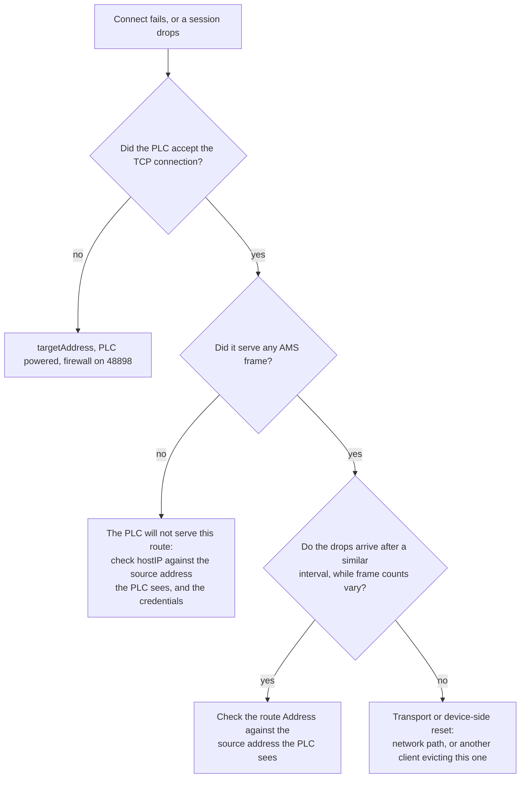

# Troubleshooting

Start from the symptom. Every entry below refers to the plugin's own log output, which Benthos
writes to stdout; `--log.level DEBUG` adds the per-request detail. With no access to those logs, the
one check worth making from the PLC side is whether a route exists for this client and what address
it holds: see [Getting a route onto the PLC](networking.md#getting-a-route-onto-the-plc).

| Symptom | Most likely cause | Where to look |
|---|---|---|
| Connects, registers symbols, no values arrive | `hostIP` is not the address the PLC sees | [Which kind of drop happened](#reading-a-disconnect) |
| Log stops after `Connecting to PLC` | Wrong address, PLC off, or firewall on 48898 | [Which kind of drop happened](#reading-a-disconnect) |
| `route ... was registered but the PLC did not serve it` | Route address or credentials | [Repeated route failures back off](#why-retries-slow-down) |
| Values arrive in bursts with gaps between | Connection dropping and reconnecting | [Reconnection](#reconnection) |
| Values stop but the input keeps running | Notification delivery went silent | [Silent notification delivery](#silent-notification-delivery) |
| The input reconnects every few seconds | A health check port-scanning 48898 | [PLC connection check](networking.md#plc-connection-check) |
| Timestamps decades in the past or future | The PLC's own clock, used for notification samples | [Symbols and metadata](symbols-and-metadata.md#metadata-outputs) |
| `could not bind the inbound AMS port` and every request times out | The device answers on its own connection, and `48898` is taken on this host or blocked inbound | [How a route is matched](how-it-works.md#how-a-route-is-matched) |

## Reading a disconnect



A failed connect logs a `hint` field naming the likely cause, and the PLC closing the connection is reported as one of two different cases:

| Log says | Meaning | Where to look |
|----------|---------|---------------|
| the PLC did not accept a TCP connection | Nothing answered on the ADS port | `targetAddress`, PLC powered, firewall |
| closed it without serving a single AMS frame | TCP accepted, but the route does not authorise this client | `username`/`password`, `hostIP` (set it explicitly behind NAT or a VPN), another client holding the route from the same host |
| dropped a connection that was already carrying AMS frames | Transport or device-side reset, not a configuration error | Network path (VPN or subnet-router flaps), and whether another client is evicting this one, a Beckhoff AMS router serves one TCP connection per host and closes the older |

If those drops arrive after a similar interval each time while the frame counts vary, suspect
configuration rather than the network: most often a route whose `Address` does not match the
source the PLC sees. See
[PLC behind a NATing gateway](networking.md#plc-behind-a-nating-gateway-or-subnet-router).

## Reconnection

The plugin automatically reconnects when the TCP connection is lost (e.g. network cable unplugged, PLC restart). TCP keepalive is set to probe after 3 s idle, then every 2 s, five times, so a dead connection is
declared after about 13 s. On reconnect, the plugin:
1. Re-establishes the TCP connection, retrying indefinitely on the backoff ramp below
2. Reloads the symbol table from the PLC
3. Re-subscribes all notification handles

No manual intervention is needed.

## A device that keeps dropping

Reconnect delays ramp `1s → 5s → 15s → 30s` and stay at the cap. A connection that drops
repeatedly is treated as flapping and gets that cap as a cooldown, so a PLC that resets an
established connection every few seconds spends most of its time waiting rather than reading, the
default deliberately favours the PLC's socket table over stream continuity, since every reconnect
costs it an accepted socket.

Where the samples matter more than the sockets, lower the cap, accepting one more accepted socket
on the PLC per reconnect:

```yaml
maxReconnectInterval: 5s
```

The lower tiers are pulled down with it so the ramp stays valid. Check the drop verdict below
first: if the drops are the route not being served, a faster reconnect makes it worse.

## Silent notification delivery

Notification delivery can stop **without the TCP connection dropping**, so there is no error and no
reconnect. The [connection heartbeat](how-it-works.md#the-connection-heartbeat) is what notices:
once its beats stop for `notificationSilenceTimeout`, the subscriptions count as dead and
`heartbeatRecovery` decides what happens next:

| Value | Behaviour | Use when |
|-------|-----------|----------|
| `immediate` (default) | Re-subscribes at once: one delete plus one add per symbol, in a burst | The PLC answers reliably; fastest recovery from a genuine subscription death |
| `confirm` | Waits for a second consecutive silent window, then re-subscribes | The PLC stalls under load. Twice as slow to notice a real death, but one late beat no longer churns every handle |
| `rebuild` | Drops the session and reconnects from scratch, re-registering every subscription as part of a fresh connect | The PLC ignores the churn. A device that is not answering times out on both the delete and the add, so every symbol costs two `requestTimeout` waits (5 s each by default) and never recovers, where a reconnect takes about a second |

An input that keeps running while delivering nothing is the failure this protects against: with
`rebuild` the reconnect is visible in the logs, and the plugin reports itself disconnected so the
pipeline restarts the input rather than sitting on dead handles.

## Why retries slow down

A route the PLC will not serve cannot be fixed by retrying, and every attempt costs the PLC a route
registration and a socket, and enough of them will wedge its route table. So failed connects are paced
by the plugin:

| Failure | Next attempt |
|---|---|
| Ordinary (dial refused, session rejected) | 1s, doubling to a 1 min ceiling; a rebooting PLC is still picked up promptly |
| The PLC will not serve the route | 30s, doubling to 5 min |
| Three consecutive route failures | Route registration is skipped entirely for 5 minutes |

The log says which is happening: `Waiting before the next connect attempt` with the delay, and on
the third route failure a warning that registration is being skipped and that `hostIP` must be the
address the PLC sees. Any successful connect clears all of it.

While registration is skipped the plugin also skips the probe, so the clean "route not served"
verdict is unavailable until the window expires. That is the trade for not writing to the
device's route table.
