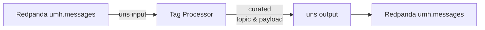

# UNS (Input)

> **Works exclusively with UMH Core**
> Inside UMH Core you can leave the block empty — `uns: {}`.
> If you run the plugin elsewhere, at minimum set `broker_address`.

#### 1 Quick-start (99 % of users)

```yaml
input:
  uns:                     # nothing else needed on UMH Core
    umh_topic: "umh\\.v1\\..+" # optional regex – here "take everything"
pipeline:
  processors:
    - tag_processor:       # enrich, rename, move to UMH data model
        defaults: |
          msg.meta.location_path = "enterprise.demo.plant1.line1.plc1";
          msg.meta.data_contract = "_historian";
          msg.meta.tag_name      = "value";
          return msg;
output:
  uns: {}                  # hand the curated data back to UMH Core
```

| What | Default inside UMH Core |
|------|------------------------|
| **Broker address** | `localhost:9092` (embedded Redpanda) |
| **Kafka topic** | **`umh.messages`** (hard-wired) |
| **Consumer group** | `uns_plugin` |
| **Filter regex** | `.*` → receive all keys; override with topic: to limit what you pull |

#### 2 Optional overrides

```yaml
input:
  uns:
    umh_topic:           "umh\\.v1\\.acme\\.berlin\\..*"   # only Berlin site
    broker_address:  "edge-redpanda:9092"
    consumer_group:  "analytics_reader"
```

| Field | Purpose & Default |
|-------|-------------------|
| `umh_topic` | Regex against the Kafka key (UMH topic). Default `.*`. |
| `broker_address` | Comma-separated bootstrap list. Default `localhost:9092`. |
| `consumer_group` | Consumer-group ID (offset tracking). Default `uns_plugin`. |

#### 3 What the plugin does behind the scenes

1. **Poll** `umh.messages` continuously.

2. **Filter** records whose umh_topic matches the topic regex (fast path if you only need a subset).

3. **Convert** each record into a Benthos message:
  - Payload → Value (raw bytes).
  - Metadata →
    - `kafka_timestamp_ms` - Kafka record timestamp in milliseconds (when the record was written to Kafka)
    - `kafka_msg_key` - Original Kafka message key (same as umh_topic)
    - `kafka_topic` - Physical Kafka topic name (e.g., "umh.messages")
    - `umh_topic` - **UMH topic structure** from Kafka message key (e.g., "umh.v1.enterprise.plant1._historian.temperature")
    - Every Kafka header becomes `meta(...)` for processors downstream

4. **Batch-safe ACK** – commits offsets only when the whole Benthos batch succeeds.

**Performance note**
A very complex regular expression can cost CPU (back-tracking). Stick to anchored, specific patterns such as
`umh\\.v1\\.acme\\.(berlin|munich)\\..*` rather than `.*temperature.*` if throughput matters.

#### 4 Typical end-to-end flow



Use this pattern when you need to tap into the Unified Namespace, enrich / transform the stream, and publish the result back (or to another cluster).

#### 5 FAQs / Troubleshooting

- **"No messages appear"** – your regex under `topic:` filtered everything out.
  Start with `.*`, verify flow, then tighten the pattern.

- **"consumer group lag grows forever"** – your pipeline never ACKs.
  Check downstream processors / outputs for errors; the input only commits on ACK.

</details>