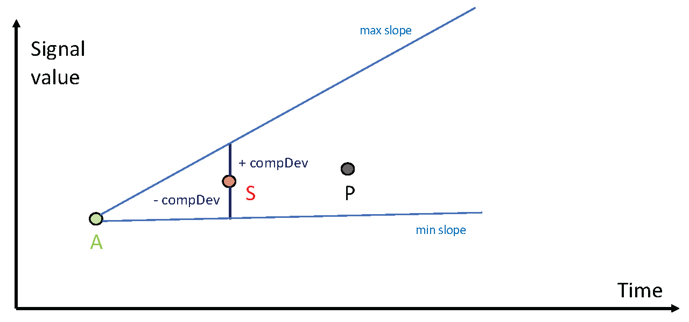
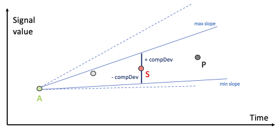
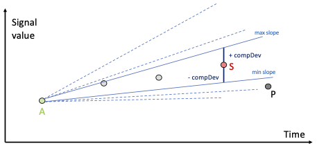
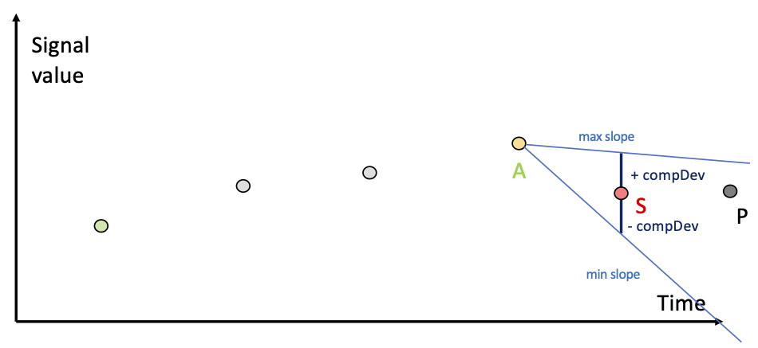
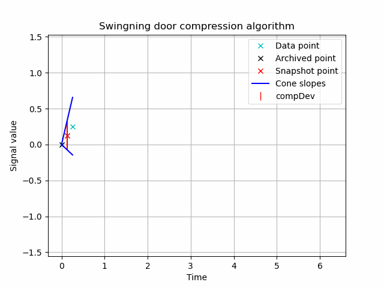

## Downsampler in a Nutshell

The UMH **Downsampler** sits between the field bus and your persistence layer and performs one task with provable bounds: **it discards samples that do not contribute new information**.

### Supported compression modes

* **Dead-band** – forwards every *value change*, suppresses byte-for-byte repeats, and—if `max_time` is set—adds an audit heartbeat.
* **Swinging-Door Trending (SDT)** – maintains a slope-aware envelope; a sample is forwarded only when it would exceed a fixed vertical error bound.

Wildcard overrides let you apply a conservative baseline (`deadband {threshold: 0}`) and refine it only where tighter compression is beneficial.

### Recommended deployment points

1. **First hop into the Unified Namespace**
   *Configuration:* `deadband {threshold: 0, max_time: 30m}`
   *Effect:* Removes pure duplicates while guaranteeing one confirmatory message every 30 min. No latency is introduced.

2. **Noise suppression anywhere in the stream**
   *Configuration:* `deadband {threshold: 2 × σ_noise, max_time: 1h}`
   *Effect:* Removes fluctuations beneath the sensor's specified noise floor yet retains all legitimate steps. No latency is introduced.

3. **Final stage before the historian**
   *Configuration:* `swinging_door {threshold: 2 × σ_noise, min_time: physics_limit, max_time: 1h}`
   *Effect:* Achieves 95–99 % volume reduction while preserving slope integrity and audit heartbeat. Introduces latency of up to `max_time` as the algorithm needs to buffer the last point before it can be emitted.

Discrete counters and alarms should remain on `deadband {threshold: 0}`; SDT's emit-previous logic could delay a critical state change.

> **Compliance note** – Both algorithms enforce an absolute error bound and maintain a heartbeat, but they still remove data. If your GxP / 21 CFR Part 11 process mandates a full raw stream, archive the unfiltered UMH-core topic in parallel.


---

## 1  Quick-start Configuration

```yaml
processors:
  - downsampler:
      default:                     # safe baseline for every topic
        late_policy: passthrough   # global policy for late arrivals
        deadband:
          threshold: 0             # keep every change
          max_time: "30m"          # 30-minute heartbeat
      overrides:                   # finer control
        - pattern: "*.temperature"
          deadband:
            threshold: 0.1         # 2 × 0.05 °C noise
        - pattern: "*.furnace*"
          late_policy: drop        # can override per pattern
          swinging_door:
            threshold: 0.1
            min_time: "5s"
            max_time: "1h"
```

*Nothing else is required.*
Messages that aren't strict UMH-core time-series (`value` + `timestamp_ms`) pass straight through.

**Pattern Matching:** The `pattern` field uses **shell-style glob patterns** (not regex). Supported wildcards:
- `*` matches any sequence of characters (e.g., `"*.temperature"` matches topics ending in "temperature")
- `?` matches any single character 
- `[abc]` matches any character in brackets
- Examples: `"*.temperature"`, `"*sensor*"`, `"temp_?"`, `"sensor[12]"`

**Important:** When an override pattern specifies both `deadband` and `swinging_door` algorithms, the more advanced **swinging door** algorithm takes precedence and deadband parameters are ignored.

---

## Algorithm & Parameter Deep Dive

The Downsampler exposes just four parameters; once you understand their purpose you can configure the system with confidence.


| Parameter     | Purpose                                                                                          | Typical setting                                                                            | Issue it prevents                                                               |
| ------------- | ------------------------------------------------------------------------------------------------ | ------------------------------------------------------------------------------------------ | ------------------------------------------------------------------------------- |
| `threshold`   | Maximum absolute deviation allowed before a new point must be stored (same units as the signal). Optional, defaults to 0. | **2 × sensor-noise σ** · If σ is unknown, inspect a steady period and take ± peak spread. **Default 0** = keep any change, drop exact repeats.   | Removes pure measurement noise without masking genuine step changes.            |
| `min_time`    | Smallest physically realistic interval between meaningful changes. Available only on `swinging_door`                               | Fastest credible process period (e.g. 1 s for furnaces, 50 ms for servo torque). `0` = off | Suppresses transients caused by bursty drivers or unstable links.               |
| `max_time`    | Heart-beat that forces an output even during flat periods; also flushes any SDT buffer.          | 15 min – 1 h (aligns with 21 CFR §11 "system liveness").                                   | Ensures line-flat sensors remain visible and internal buffers stay bounded.     |
| `late_policy` | Action for out-of-order samples.                                                                 | `passthrough` (default) or `drop`.                                                         | Lets you balance historical accuracy against traffic volume on skewed networks. |

### Dead-band

* **Rule** Emit when `|v − last| ≥ threshold` or when `max_time` expires.
* **Best suited to** Duplicate removal, discrete states, counters, Boolean flags.
* **Tuning notes**

  * `threshold` is optional and defaults to 0 if not specified.
  * `threshold = 2 × σ_noise` removes sensor noise yet preserves real transitions.
  * `threshold = 0` (default) provides safe, universal de-duplication.
  * Keep `max_time` within 15 – 60 min to satisfy audit requirements.

### Swinging-Door Trending (SDT)

* **Rule** Maintain rotating upper and lower "doors" that bound the current slope; emit the **previous** point when a new sample would violate the envelope.
* **Additional parameters**

  * `threshold` – vertical tolerance (same intuition as for dead-band).
  * `min_time` – enforces physical plausibility for fast-changing signals.
  * `max_time` – still provides the audit heart-beat and buffer flush.
* **Why choose SDT** Captures long ramps with just two points, eliminating the stair-step pattern created by naïve dead-band on slow trends, while mathematically guaranteeing the reconstruction error remains ≤ `threshold`.

## Edge-case Handling & Internal Behaviour

The Downsampler runs each series in its own finite-state machine and guards two invariants:

1. **No silent loss** A point is acknowledged only after it—or the predecessor that still sits in the buffer—has been forwarded downstream.
2. **Bounded memory** At most **one** candidate is stored per series; an idle-flush watchdog empties it after `max_time`.

---

### How incoming records are routed

| Payload type            | Processing path                                    | Reasoning                                                                                 |
| ----------------------- | -------------------------------------------------- | ----------------------------------------------------------------------------------------- |
| *Numeric* (int / float) | Selected algorithm (`deadband` or `swinging_door`) | These are the signals where compression counts.                                           |
| *Boolean, string*       | Change detector (`value ≠ last_value`)             | For states and text, only transitions matter; thresholds are irrelevant.                  |
| Other JSON structures   | **Bypass** (fail-open)                             | Complex objects could hide multiple semantics—forward untouched rather than risk pruning. |

---

### Late-arrival strategy

*The timestamp of each processed sample is compared with the most recent one already seen for that series.*

* `passthrough` (default) Forward the late sample raw, flagging it with `meta:late_oos=true` (oos = "out of sequence").
* `drop` Discard and increment a metric counter—useful when stale data has no value but bandwidth is critical.

Both modes preserve at-least-once delivery for in-order traffic; only you decide what to do with stragglers.

---

### Buffered-emit logic (needed by SDT)

1. A candidate point is retained while the doors stay open.
2. When a violation occurs, the **previous** candidate is released and the new sample becomes the fresh candidate.
3. If traffic stops before the doors close, the watchdog flushes the last candidate after `max_time` to guarantee visibility.

The same mechanism ensures a graceful shutdown: during a Benthos drain, every buffered point is emitted before the plug-in confirms closure.

### Dynamic, per-message compression hints

Instead of hard-coding a rule map inside the *downsampler* you can let each message declare its own compression wishes in **metadata**. The downsampler simply reads the hints, validates them, and uses them in place of the global/default settings.
This is useful if you want to configure everything for a single tag in a single place - the tag_processor.

---

#### Metadata keys

| Meta key         | Type / allowed values                    | Maps to parameter |
| ---------------- | ---------------------------------------- | ----------------- |
| `ds_algorithm`        | `"deadband"` \| `"swinging_door"`        | algorithm switch  |
| `ds_threshold`   | float                                    | `threshold`       |
| `ds_min_time`    | Go/ISO-style duration string (`"750ms"`) | `min_time` (SDT)  |
| `ds_max_time`    | duration string (`"15m"`, `"1h"`, …)     | `max_time`        |
| `ds_late_policy` | `"passthrough"` \| `"drop"`              | late-arrival rule |
| `ds_ignore`      | any non-empty value                      | bypass downsampler completely |

#### Precedence

```
per-message metadata  →  pattern override  →  global default
```

If any field is missing the cascade falls back to the next level, so you can override only what
matters.

#### Complete bypass with `ds_ignore`

In UMH deployments, the downsampler is typically enabled by default with conservative settings to provide data compression benefits across all time-series data. However, certain message types require complete bypass of any downsampling logic to ensure data integrity.

The `ds_ignore` metadata key provides this capability and is designed to be used primarily in the **tag_processor** to selectively bypass downsampling based on message characteristics:

- **Any non-empty value** for `ds_ignore` will cause the message to skip all downsampling logic
- The message passes through unchanged, preserving all original data and metadata
- A `downsampled_by: "ignored"` metadata field is added for traceability
- No series state is created or modified for ignored messages
- Ignored messages are counted in the `messages_ignored` metric

#### Common UMH use cases

**Critical alarms and alerts:**
```yaml
pipeline:
  processors:
    - tag_processor:
        conditions:
          - if: msg.meta.tag_name === "emergency_stop" || msg.meta.tag_name.endsWith("_alarm")
            then: |
              msg.meta.ds_ignore = "true"
              return msg;
    - downsampler: 
        default:
          deadband:
            threshold: 1.0
            max_time: "30m"
```

**High-precision measurements:**
```yaml
pipeline:
  processors:
    - tag_processor:
        conditions:
          - if: msg.meta.virtual_path && msg.meta.virtual_path.includes("calibration")
            then: |
              msg.meta.ds_ignore = "bypass_precision_data"
              return msg;
    - downsampler: 
        default:
          deadband:
            threshold: 0.1
```

**State change events:**
```yaml
pipeline:
  processors:
    - tag_processor:
        conditions:
          - if: msg.meta.data_contract === "_state" || msg.meta.tag_name.startsWith("mode_")
            then: |
              msg.meta.ds_ignore = "preserve_state_changes"
              return msg;
    - downsampler: 
        default:
          deadband:
            threshold: 2.0
```

This approach allows UMH to benefit from automatic downsampling for most data while preserving critical information that requires every data point to be stored without any filtering or compression.

---

#### Tag-processor snippet – picking the right algorithm on the fly

```yaml
pipeline:
  processors:
    - tag_processor:
        defaults: |
          # generic baseline for every tag
          msg.meta.location_path = "enterprise.plant1"
          msg.meta.data_contract = "_historian"

          # safe, zero-risk compression unless told otherwise
          msg.meta.ds_algorithm       = "deadband"
          msg.meta.ds_threshold  = 0
          msg.meta.ds_max_time   = "30m"
          return msg;

        conditions:
          - if: msg.meta.virtual_path.startsWith("furnace.")
            then: |
              msg.meta.ds_algorithm      = "swinging_door"
              msg.meta.ds_threshold = 0.5
              msg.meta.ds_min_time  = "5s"
              msg.meta.ds_max_time  = "1h"
              return msg;
    - downsampler: {}
```

---

### Numerical edge cases covered in tests

| Scenario                              | Guard rail in code                                                     |
| ------------------------------------- | ---------------------------------------------------------------------- |
| `threshold < 0`                       | Configuration rejected at startup.                                     |
| `threshold = 0`                       | Legal—drops exact repeats, keeps any change.                           |
| `max_time = 0`                        | Treated as *unset* (no heart-beat, but still at-least-once buffering). |
| `min_time > max_time`                 | Validation error to prevent deadlocks.                                 |
| IEEE-754 extremes (`±Inf`, `NaN`)     | Sample is bypassed with a warning; counting metrics record the event.  |
| Clock skew (non-monotonic timestamps) | Logged and routed through late-arrival policy; compression continues.  |

With these guards the Downsampler behaves deterministically across PLC glitches, network jitter and even deliberate fuzz-test assaults—yet still errs on the side of passing the data through rather than dropping it.


### How Swinging-Door Trending keeps the essentials—step by step

1. **Segment start (point A, green).**
   From the very first sample in a segment the algorithm opens two straight "doors": an **upper** line and a **lower** line.
   *Their slopes mark the fastest rise and the slowest rise allowed while the signal stays inside the ± *compDev* error band.*
   

2. **Each new sample narrows the door.**
   Every arriving point recalculates the steepest and flattest slopes that would still stay within ± *compDev*.
   Geometrically the cone can only shrink, so the blue lines in the pictures pivot closer together frame by frame.

   

   

3. **Two working points—P and S.**

   * **P** (black) is simply the *latest* raw sample.
   * **S** (red, "snapshot") is the *candidate* we might archive.
     Unlike a dead-band filter we do **not** decide about P immediately; first we test whether S can still represent the trend after P tightens the cone.

4. **Door-slam event = keep S, start over.**
   When the upper-slope line crosses the lower-slope line the cone has closed (see img 4 / final GIF frame).

   * S is now guaranteed to be the last point that still satisfies the error bound → we **emit** S.
   * P becomes the new anchor A of the next segment, and the door re-opens to its full width.

   

5. **Heartbeat and physics limits.**
   *`max_time`* forces an emit even if the cone never closes (flat signals, watchdog audit).
   *`min_time`* ignores arrivals that come *so* fast the physical process could not have changed—useful for ovens versus millisecond-level servo data.

6. **The GIF puts it all together.**
   Blue cone lines swing, the red snapshot jumps forward, only a handful of black-× points survive, yet the reconstructed line never drifts more than ± *compDev* from the raw signal.

   

Image Source: [emrumo/swingingdoor](https://github.com/emrumo/swingingdoor)

---

**Practical take-away**

* OT engineers still see smooth ramps without the "stair-step" artefacts a naïve dead-band would create.
* IT teams hold up to **99 % fewer rows** and move far less data, with mathematically bounded error and an audit heartbeat that satisfies 21 CFR §11 / GxP record-liveness rules.